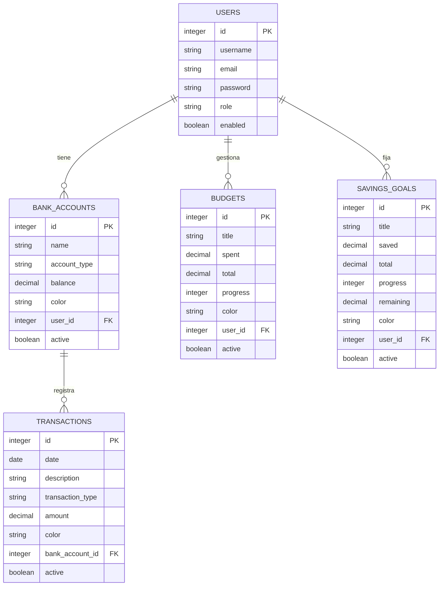

# Informe Técnico - Proyecto FINOVA

## 1. Descripción General
FINOVA es una aplicación web para la gestión de finanzas personales. Permite a los usuarios registrar cuentas bancarias, movimientos (ingresos y gastos), presupuestos y metas de ahorro. El proyecto ha evolucionado de un frontend con datos simulados (archivos JSON) a una arquitectura Full-Stack utilizando Angular (Frontend) y Spring Boot (Backend) con base de datos PostgreSQL.

## 2. Arquitectura de la Aplicación
El sistema sigue una arquitectura cliente-servidor:
*   **Frontend (Angular 18):** Interfaz de usuario interactiva y responsiva. Utiliza componentes standalone, enrutamiento, guardias de seguridad y servicios HTTP con interceptores JWT.
*   **Backend (Spring Boot 3.x):** API REST que provee los datos y la lógica de negocio. Utiliza Spring Security y JWT (JSON Web Tokens) para autenticación y autorización.
*   **Base de Datos (PostgreSQL):** Almacenamiento persistente de los datos de usuarios, cuentas, transacciones, presupuestos y metas de ahorro.

## 3. Seguridad e Intercepción de Peticiones
La seguridad se ha implementado mediante un enfoque stateless con JWT:
*   **Generación de Token:** El backend (`JwtUtil`) genera un token con los reclamos (claims) del usuario (username) cuando este se autentica mediante el endpoint `/api/auth/login`.
*   **Validación:** El filtro de seguridad (`JwtAuthFilter`) intercepta cada petición al backend, valida la firma y vigencia del token y establece el contexto de seguridad (`SecurityContextHolder`).
*   **Interceptor Angular (`jwtInterceptor`):** En el frontend, un interceptor intercepta todas las llamadas HTTP salientes, obtiene el token del `localStorage` y lo añade a la cabecera `Authorization: Bearer <token>`.
*   **Endpoint Stateless:** No se mantienen sesiones (JSESSIONID) en el servidor; cada solicitud debe estar autenticada de manera independiente con su token.

## 4. Estrategia de Eliminación (Eliminación Lógica)
Para evitar la pérdida de datos históricos o problemas de integridad referencial, se ha implementado **eliminación lógica (Soft Delete)**:
*   **Diseño de Entidades:** Cada entidad (`User`, `BankAccount`, `Transaction`, `Budget`, `SavingsGoal`) cuenta con un campo booleano `active`, con valor por defecto `true`.
*   **Capa de Acceso a Datos (Repositories):** Se crearon métodos personalizados (ej. `findByUser_UsernameAndActiveTrue`) para asegurar que solo los registros con `active = true` sean retornados por los métodos GET.
*   **Lógica de Negocio (Services):** El método `delete()` de los servicios no utiliza `repository.delete()`. En su lugar, recupera la entidad, cambia `active = false` y guarda la entidad actualizada, "ocultándola" de la vista del usuario pero conservándola en la base de datos para auditorías u otros propósitos.

## 5. Diseño de Base de Datos y Diagrama ER
La base de datos relacional incluye cinco tablas principales con relaciones uno-a-muchos.

### Diagrama de Entidad-Relación (Mermaid)

### Relaciones:
*   Un usuario puede tener múltiples cuentas bancarias.
*   Un usuario puede tener múltiples presupuestos.
*   Un usuario puede tener múltiples metas de ahorro.
*   Una cuenta bancaria puede tener múltiples transacciones (ingresos/egresos).

## 6. Configuración de CORS
Para permitir la comunicación entre el frontend (ejecutándose típicamente en `http://localhost:4200`) y el backend (`http://localhost:8080`), se configuró CORS (Cross-Origin Resource Sharing) en Spring Security (`SecurityConfig.java`). Esto autoriza solicitudes provenientes de dominios diferentes, habilitando los métodos `GET`, `POST`, `PUT` y `DELETE` necesarios para el CRUD, y exponiendo la cabecera `Authorization`.

## 7. Conclusión
La integración transformó la maqueta inicial en una aplicación web transaccional segura y escalable. La adopción de JWT y el patrón de eliminación lógica aseguran buenas prácticas de desarrollo en sistemas de información modernos.
